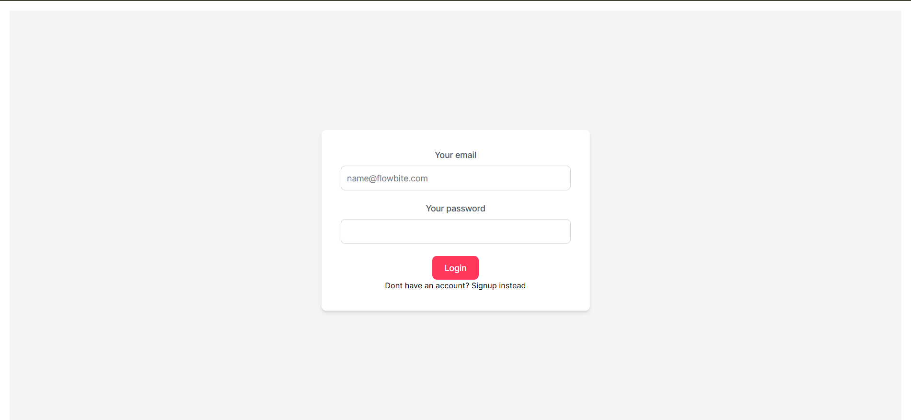
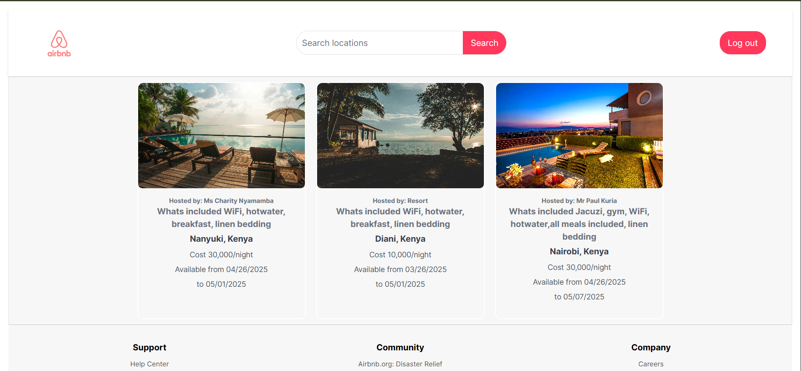
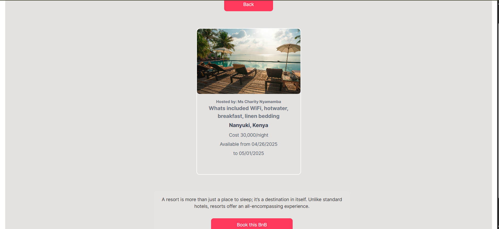
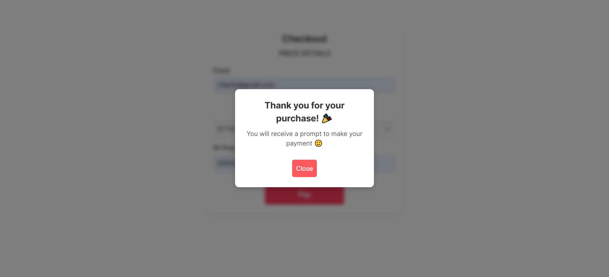
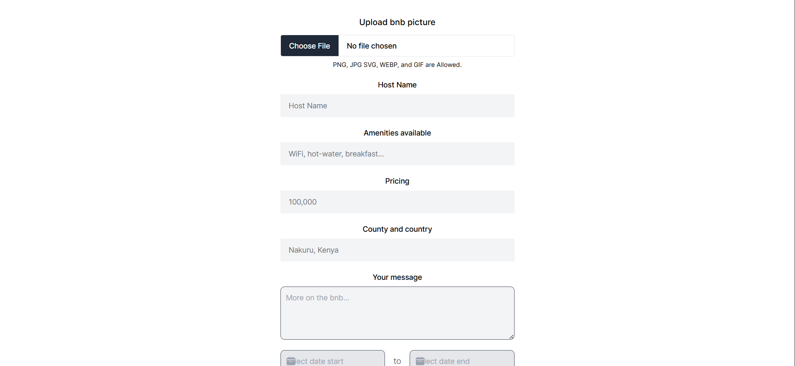

# 🏠 Airbnb Clone — Minimalist Property Listing Site

A clean and interactive Airbnb-style clone built using **React** and **Tailwind CSS**, focusing on showcasing property listings.  
The app provides a modern UI for browsing rental spaces, with dynamic property cards and filterable content.
---

## ✨ Features

- 🏘 View listings for various rental properties
- 🖼 Modern and minimal UI with soft hover effects
- 🔍 Filter by price, type, and location (static filters)
- 📱 Fully responsive design for mobile and tablet

---
## 📁 Project Structure

```
/frontend        # Frontend (React with Vite)
/backend       # Backend (Express.js)
/backend(pg admin)      # SQL setup (tables and seed data)
```
---
---

## ⚙️ Tech Stack

- **Frontend:** React, Tailwind CSS
- **Routing:** React Router DOM
- **State Management:** useState
- **Other Tools:** Vite, Pexels

---

## 🚀 Getting Started

1. Clone the repository:
   ```bash
   git clone https://github.com/Cnnb01/DeveInt-Projects.git
   cd DeveInt-Projects/REACT_E-COMMERCE
   ```
### 🛠 Backend Setup

1. Navigate to the backend directory:
   ```bash
   cd server-backend
   ```

2. Install dependencies:
   ```bash
   npm install
   ```

3. Start the server:
   ```bash
   node server.js
   ```

> The backend will run on:  
> `http://localhost:8000`

---
### 🎨 Frontend Setup (Vite)

1. Navigate to the frontend directory:
   ```bash
   cd react-front-end
   ```

2. Install dependencies:
   ```bash
   npm install
   ```

3. Run the development server:
   ```bash
   npm run dev
   ```

> App runs on:
> `http://localhost:5173`

---

## 📬 Contact

Made with 💙 by **Charity Nyamamba**

- 🌐 LinkedIn: [Charity](https://www.linkedin.com/in/charity-nyamamba/)


---

## 📸 Screenshots

> Login page 
> Homepage Dashboard 
> Single bnb page 
> Payment's page for single bnb 
> Admin's page 

---