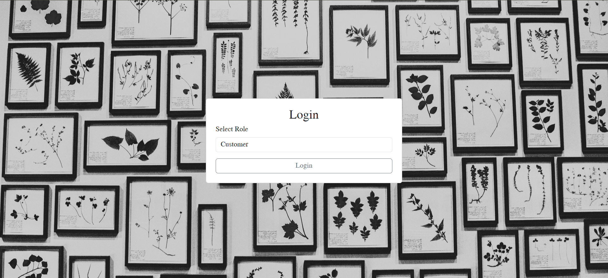
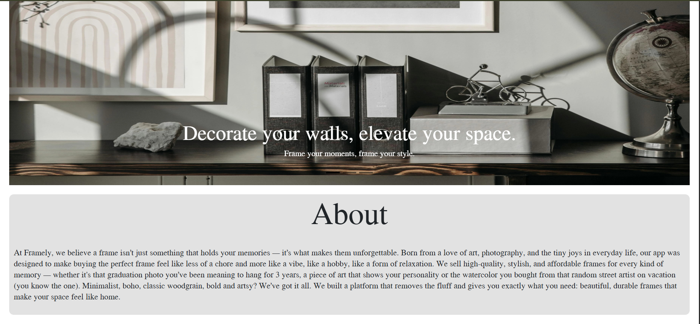
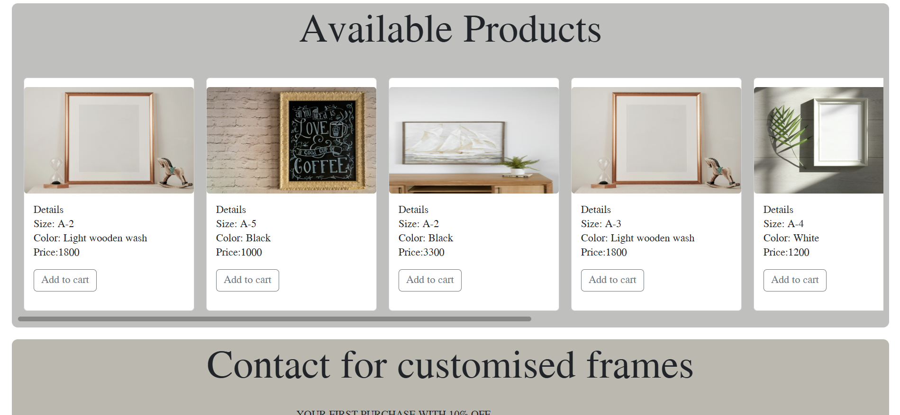
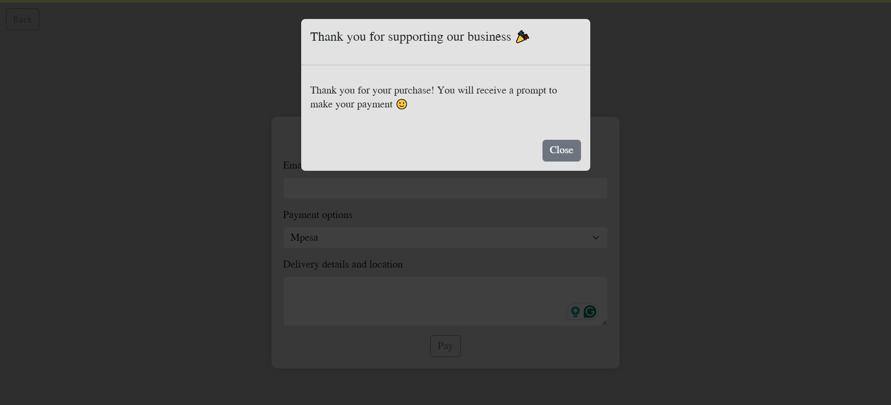
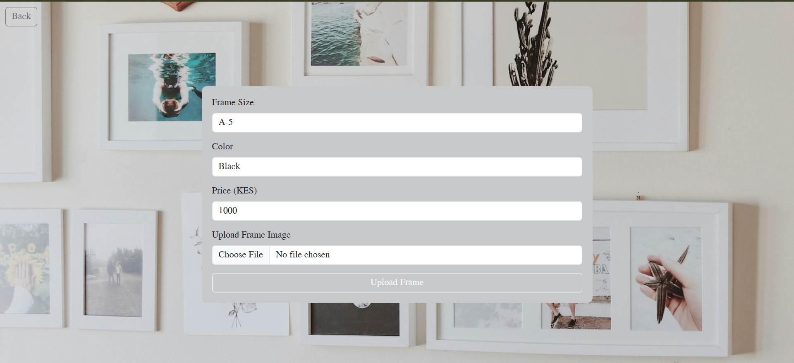

# 🖼 Framely — Frame Selling E-Commerce Website

A fully responsive e-commerce website built using **React** and **Bootstrap CSS**, designed for selling decorative frames and wall art.
Framely offers a clean, aesthetic shopping experience where users can browse frame collections, view details, and add items to their cart.

---

## ✨ Features

- 🖼 Browse a collection of frames with images and pricing
- 🛒 Add frames to cart
- 💵Purchase available frames
- 📱 Responsive design optimized for mobile and desktop

---
## 📁 Project Structure

```
/frontend        # Frontend (React with CRA)
/backend       # Backend (Express.js)
/backend(pg admin)      # SQL setup (tables and seed data)
```
---

## ⚙️ Tech Stack

- **Frontend:** React, Bootstrap CSS
- **State Management:** useState, useEffect
- **Other Tools:** CRA, Pexels

---

## 🚀 Getting Started

1. Clone the repository:
   ```bash
   git clone https://github.com/Cnnb01/DeveInt-Projects.git
   cd DeveInt-Projects/REACT_E-COMMERCE
   ```
### 🛠 Backend Setup

1. Navigate to the backend directory:
   ```bash
   cd server-backend
   ```

2. Install dependencies:
   ```bash
   npm install
   ```

3. Start the server:
   ```bash
   node server.js
   ```

> The backend will run on:  
> `http://localhost:8000`

---
### 🎨 Frontend Setup (Vite)

1. Navigate to the frontend directory:
   ```bash
   cd react-front-end
   ```

2. Install dependencies:
   ```bash
   npm install
   ```

3. Run the development server:
   ```bash
   npm start
   ```

> App runs on:
> `http://localhost:3000`

---

## 📬 Contact

Made with 💙 by **Charity Nyamamba**

- 📧 Email: [nyamambanyaguch@gmail.com](mailto:nyamambanyaguch@gmail.com)
- 🌐 LinkedIn: [Charity](https://www.linkedin.com/in/charity-nyamamba/)


---

## 📸 Screenshots

> Login page 
> Homepage Dashboard 
> Homepage Dashboard(part 2) 
> Payment's page for single frame 
> Admin's page 

---